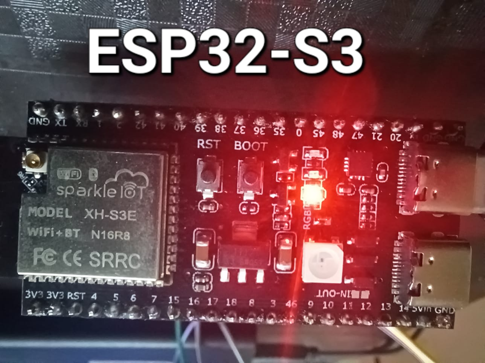
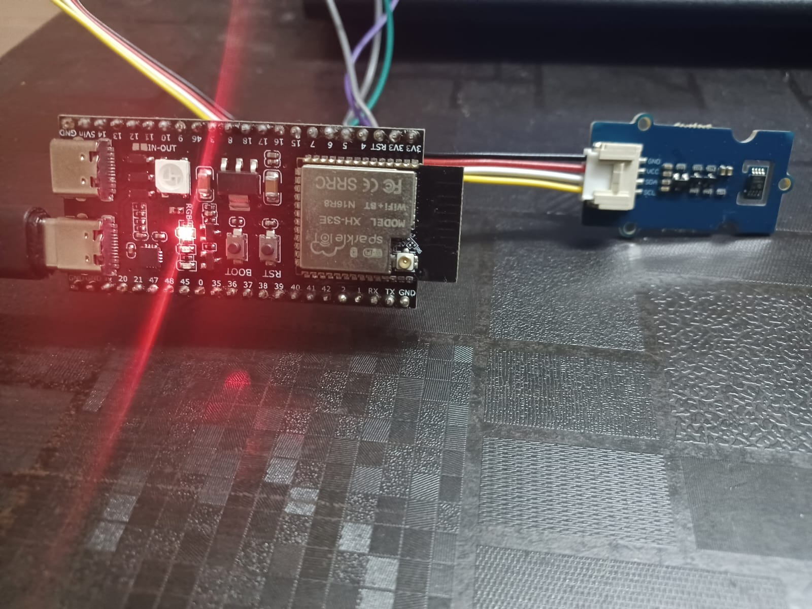
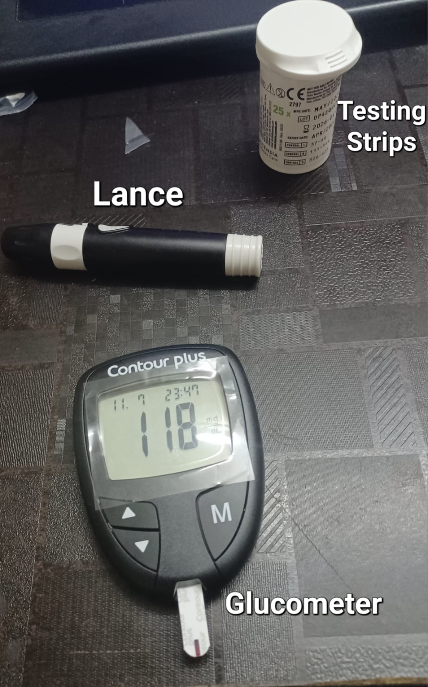
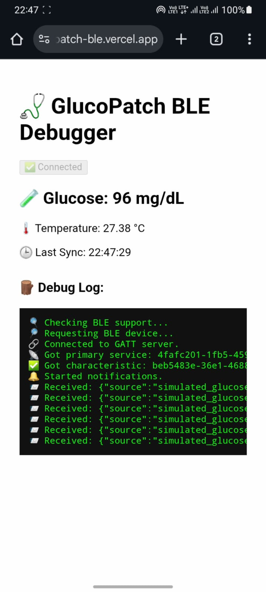
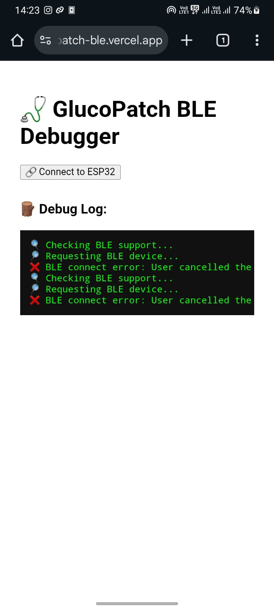
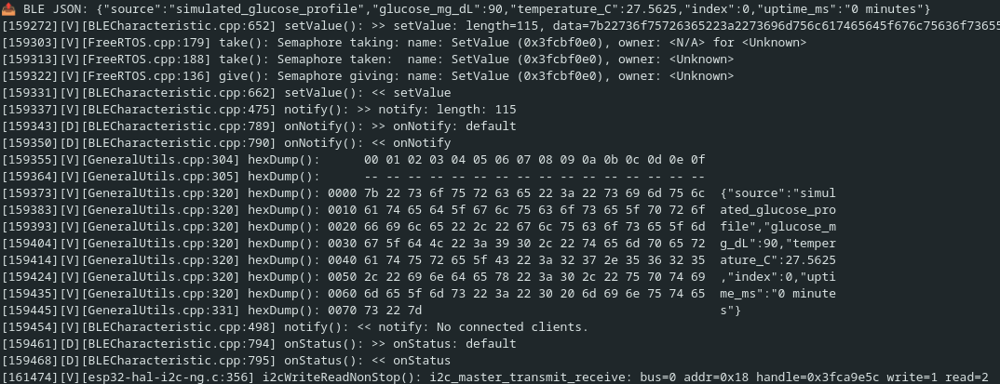

# GluCoGuard: Smart Wearable Patch for Diabetes Monitoring

**Team:** Stalkfish
**Institution:** B.M.S College of Engineering, Bangalore
---

## 🧪 Overview

**GluCoGuard** is a low-cost (INR \~3750 prototype, targeting INR 2000–3000) smart wearable patch designed to provide **continuous, minimally-invasive glucose monitoring**. The system uses the Contour Plus Glucometer for discrete readings and applies **interpolation techniques** to simulate continuous data. BLE-enabled, it streams readings in real-time to a custom app, with future plans for automated drug delivery.

---

## 🔧 Features

* **Glucose Measurement:** Contour Plus glucometer, readings interpolated for continuity
* **Temperature Compensation:** MCP9808 sensor (±0.5°C accuracy)
* **Controller:** ESP32-S3 for data processing, BLE broadcasting
* **Sampling Rate:** 1 reading per second (broadcast only)
* **BLE App:** Custom-built debugger on Vercel
* **TRL-8 Readiness:**

  * MARD <10%
  * Drift <5%
  * BLE packet delivery: 99.9%

---

## 📦 Bill of Materials

| Component Type     | Parts                    | Cost (INR) | Purpose                    |
| ------------------ | ------------------------ | ---------- | -------------------------- |
| Glucose Meter      | Contour Plus + 25 Strips | 1495       | Glucose measurement        |
| Temperature Sensor | MCP9808                  | 889        | Environmental compensation |
| Microcontroller    | ESP32 S3                 | 1494       | Processing + communication |

> *Note: 25 test strips were bundled. Manual insertion still required.*

---

## 🖥️ Firmware Workflow

* Programmed in PlatformIO + Arduino
* FreeRTOS-based loop for non-blocking BLE communication
* Broadcasts JSON-formatted readings every second
* Temperature sensor connected via I2C; glucose via ADC

📁 `firmware/src/main.ino`

---

## 📡 BLE Transmission

* **Mode:** GATT Server
* **UUIDs:** Standard, auto-generated
* **Packet Format:**

```json
{
  "source": "simulated_glucose_profile",
  "glucose_mg_dL": 90,
  "temperature_C": 27.56,
  "index": 0,
  "uptime_ms": "0 minutes"
}
```

* **Receiver:** [glucopatch-ble.vercel.app](https://glucopatch-ble.vercel.app) (custom app with debug)
* **Repo:** [github.com/nnish14/glucopatch-ble](https://github.com/nnish14/glucopatch-ble)

---

## 📷 Hardware Gallery

| Image                                                          | Description                                   |
| -------------------------------------------------------------- | --------------------------------------------- |
|                       | ESP32-S3 used for BLE broadcasting            |
|                | MCP9808 connected via I2C to ESP32-S3         |
|  | Contour Plus, lancing device, and test strips |
|                 | Live BLE JSON packets on debugger             |
|                   | Debug log with BLE connection error           |
|            | Serial monitor output from ESP32              |

---

## 📊 Interpolation Engine

To simulate continuous glucose tracking, we apply **cubic spline interpolation** on manually sampled readings every \~15 min.

📁 `docs/Interpolation_Technique.md`

> ⏳ **MARD:** 9.67% | 📉 **Drift:** 4.25%

📁 `testLog/mard_drift_analysis.py`

---

## 🧪 Testing Plan (TRL-8 Metrics)

| Metric              | Value                    | Method                           |
| ------------------- | ------------------------ | -------------------------------- |
| MARD                | <10%                     | Interpolated vs Reference data   |
| Drift (24h)         | <5%                      | Begin vs end-point comparison    |
| BLE Packet Delivery | >99.9%                   | Debug log & console monitor      |
| Power Test          | Bench-powered            | Future Li-Po integration planned |
| Wearability         | ✅ Trialed on 1 volunteer | Glucometer remains external      |

---

## 📱 User Guide (Prototype)

1. Insert strip into Contour Plus
2. Lance fingertip and apply blood
3. Get a good range of Samples
4. Interpolate data for desired sampling frequency
5. use the trends to indetify key parts of the values (glycemic index (GI), postprandial state, glucose spike, glucose dip, and area under the curve (AUC)) 
6. Use these to for a model for your glucose-twin
3. Read glucose value and send to ESP32 via UART or BLE JSON (in live mode)
4. ESP32 broadcasts every second
5. View real-time data via [BLE Debugger App](https://glucopatch-ble.vercel.app)

> 📦 Enclosure is under development. Patch Form factor work is in progress.
---

## 🔭 Roadmap

* ✅ BLE JSON streaming
* 🔜 Integrate Li-Po (1000mAh) + TP4056
* 🔜 PDMS-based thin-film actuator for insulin delivery
* 🔜 Add MPU6050 accelerometer for activity compensation
* 🔜 Firebase-based caregiver alert system (via MQTT)
* 🔜 Replace with Indian-made GOx-based sensors (e.g., from IIT-M)

---
## 📜 License

[MIT License](LICENSE)

---

## 📬 Contact

**N Nishchit**
📧 [nnishchit48@gmail.com](mailto:nnishchit48@gmail.com)
📱 +91 9483938838

---

## 🧠 Acknowledgments

* WHO India, Diabetes Report (2021)
* ISO 15197:2013 Guidelines
* IIT Madras, DBT Biosensor Initiative
* Espressif ESP32-S3 Documentation
* HUPA-UCM Diabetes Dataset

---

## 🏁 Live Links

* 🔗 **BLE Debugger App:** [glucopatch-ble.vercel.app](https://glucopatch-ble.vercel.app)
* 💻 **Frontend Repo:** [github.com/nnish14/glucopatch-ble](https://github.com/nnish14/glucopatch-ble)
